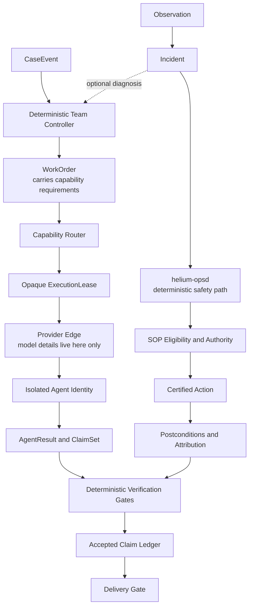

# Helium

Helium is the always-on agent harness for our research and operations ecosystem.

It turns small, declarative job files into isolated and observable agent runs.
DeepSeek Harness supplies the underlying agent runtime. Helium adds ecosystem
capabilities, triggers, escalation, persistence, delivery, health checks, and
release operations.

The current production release is `v0.1.11`.

## What works today

The Helium tenant lane can:

- discover every `plugins/<name>/tenant.yaml`, with no registry and no list to edit;
- route work by declared capability, never by model or vendor;
- validate every role's declared tools against the merged tenant vocabulary,
  refusing a role that names a tool no tenant provides;
- run deterministic verification gates before anything enters the accepted-claim
  ledger, which the host builds — a model can name a claim key but never supply
  the claim or its evidence;
- record a durable delivery intent before any send, and close it with a real
  terminal outcome;
- write reports and append-only JSONL records;
- send rate-limited email, gated on both the tenant's declared mode and an
  operator env flag;
- expose heartbeats, canaries, and dead-man monitoring;
- deploy tagged releases with a tested rollback path; and
- isolate a malformed tenant so it does not stop the others.

The first production tenant is `option-wizard`.

```text
Cron trigger -> team controller -> capability routing -> verification gates
             -> accepted-claim ledger -> delivery intent -> delivery outcome
```

Alongside that compatibility lane, the bounded P4 path now runs the Macro
reference team in production `review-only` mode. One controlled case completed
all eight capability-routed Codex roles, persisted hash-verified artifacts, and
stopped at an attributable human-review decision with no team email or
mutation. The deterministic `helium-opsd` collector also runs independently of
providers; its first approve-only controlled drill restored one deliberately
stopped monitoring container, verified the recovery evidence, and returned to
observe-only ownership. It now also runs a signed `suggest-only` window: a
second controlled stop produced a certified recovery suggestion, executed
nothing, and retained the operator's signed alternate decision across a cold
daemon restart.

This is a working multi-agent and Ops system, not unrestricted autonomy. The
Macro team cannot deliver automatically, the human review inbox is the
immediate fallback, and Ops currently has no standing approve or automatic
authority. The five-trading-day window, a real material Macro case, and the
longer Ops observation window are still accruing P4 evidence.

## Where Helium is going

Helium's core will be model-blind. A team describes the capabilities it needs,
not a model vendor or model name. Pluggable providers register execution
targets and measured capability profiles. A router selects an eligible target
from task requirements, safety constraints, budget, latency, evaluations, and
operator preferences.

The diagram below is the canonical topology now used by the bounded P4 team and
Ops paths. The
[canonical design](docs/plans/2026-08-25-helium-multi-agent-design.md#55-canonical-agent-and-verification-evidence-topology)
is normative.



DeepSeek, Claude, Codex, local models, and future providers are inventory at the
edge of the system. They are never fixed roles inside Helium core.

See:

- [Helium v1 review](docs/reviews/2026-08-25-helium-v1-review.md)
- [Mac mini model-selection probe](docs/reviews/2026-08-25-model-selection-probe.md)
- [Multi-agent design](docs/plans/2026-08-25-helium-multi-agent-design.md)
- [Provider effort-selection design](docs/plans/2026-08-25-provider-effort-selection-design.md)
- [Provider effort-selection implementation plan](docs/plans/2026-08-25-provider-effort-selection-implementation.md)
- [Multi-agent master plan](docs/plans/2026-08-25-helium-multi-agent-master-plan.md)
- [Multi-agent implementation plan](docs/plans/2026-08-25-helium-multi-agent-implementation.md)
- [P4 production execution record](docs/plans/2026-08-30-helium-p4-production-execution.md)

## Design principles

- Plugins instead of provider-specific branches
- Isolated context and least-privilege tools
- Explicit messages and artifacts instead of hidden shared context
- Append-only records before external side effects
- Deterministic policy around probabilistic agents
- Independent verification before delivery
- Restart-safe execution, bounded budgets, and fast rollback
- Measured capability routing instead of model reputation

## Repository map

- `packages/core` -- schemas, state, and ecosystem capabilities
- `plugins/helium` -- DeepSeek Harness integration
- `plugins/<tenant>` -- self-contained tenants
- `profile` -- deployable DSH profile
- `scripts` -- release, health, canary, and recovery operations
- `contracts` -- compatibility and runtime contracts
- `docs` -- design, evidence, reviews, and plans

## Development

Requirements:

- Node.js 22.19 or newer
- pnpm
- the exact DSH prerelease pinned by this repository

```bash
pnpm install --frozen-lockfile
pnpm build
pnpm typecheck
pnpm test
pnpm test:contracts
pnpm test:e2e-local
```

Normal CI does not call a live model. Live provider contracts are explicitly
opt-in and require their own credentials.

### Running it somewhere other than the author's machine

Helium was built against one production host, and the release scripts default
to it. Nothing is welded to that machine. `deploy.sh` and `rollback.sh` ssh into
`$HELIUM_DEPLOY_HOST` (default `macmini`) and re-exec themselves there; every
path they touch -- `~/projects/helium-releases`, `~/.helium`,
`~/Library/LaunchAgents` -- hangs off that host's own `$HOME`. Set
`HELIUM_DEPLOY_HOST` and the whole release path follows.

The launchd templates in `launchd/` carry `__PLACEHOLDER__` tokens instead of
absolute paths. `scripts/ops/install-observe-only.sh` resolves them and refuses
to install a plist with any left over; the two older labels
(`com.helium.dsh`, `com.helium.deadman`) have no installer and are substituted
by hand, so check them yourself before loading:

```bash
grep -o '__[A-Z0-9_]*__' ~/Library/LaunchAgents/com.helium.dsh.plist   # must print nothing
```

Paths under `docs/` are a different matter and are deliberately left alone.
They are dated records of what actually ran on a specific machine -- evidence
logs, review notes, plans. Rewriting an absolute path inside a recorded
observation would make the record say something that never happened, which is
the failure the whole evidence discipline exists to prevent. Read them as
history, not as configuration examples.

## Adding a tenant

A tenant is a directory, not a registry entry. Create `plugins/<name>/` with
four files:

- `package.json` -- a workspace package, built to `lib/`
- `tenant.yaml` -- identity, cron triggers, promotion mode, delivery policy,
  the environment key NAMES its tools need, and one opaque `extensions:` block
  the host never reads inside
- `team.yaml` -- roles by required capability and the task DAG; never a model
  or a vendor
- `tools/index.ts` -- `VOCABULARY` plus `buildTools(cfg)`, each tool carrying
  its own dsh parameter spec

Discovery is a glob over `plugins/*/tenant.yaml`; there is nothing else to
edit. Tenants are validated independently and in isolation: a malformed
manifest, a tool module that throws, a role naming an unknown tool, or a failed
readiness probe skips exactly that tenant with a recorded reason, and the
others keep running. A duplicate tenant NAME is the one exception and fails the
whole load, because every per-tenant record downstream keys on that name.

## License

MIT. See [LICENSE](LICENSE).

## Safety

Read-only capability is the default. A prompt is never a permission boundary.
Mutating tools require explicit policy, process isolation, an audit trail, and
separate approval. Provider processes must not inherit undeclared tools,
settings, MCP servers, or workspace access.

Production changes go through pull requests and tagged releases. Do not push
directly to `master` and do not change the mini during an active acceptance
window.
