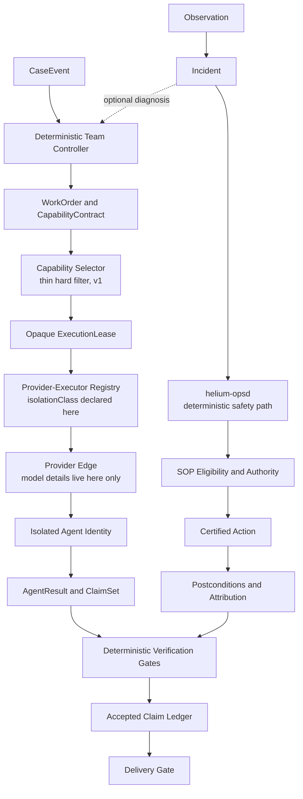

# Helium Multi-Agent Design

**Date:** 2026-08-25

**Last revised:** 2026-08-28 — executor registry and isolation class, thin
capability selector, `quota-exhausted`, mailbox deferral, per
`docs/reviews/2026-08-28-plan-review-adjudication.md`; WorkOrder key-casing
note (R2), catalog billing model (R6), and the `EX-1` exemption against
acceptance criterion 16 (R5), per
`docs/reviews/2026-08-28-adjudication-round-2.md`

**Status:** Approved architecture direction

**Scope:** Helium v2 control plane, provider boundary, capability selection, and
multi-agent execution

## 1. Decision

Helium will evolve from a configurable two-lane runner into a durable,
pluggable multi-agent control plane.

The central invariant is:

> **Helium core is model-blind.** Core code does not know provider names, model
> names, model families, authentication methods, or transport protocols.

Core describes work as capabilities, constraints, budgets, evidence contracts,
and acceptance criteria. Provider plugins maintain the execution inventory and
translate an opaque execution lease into a concrete model invocation.

This is model-blind decision-making, not model-blind auditing. Every completed
run must still record the exact provider, model version, configuration, cost,
and capability snapshot supplied by the provider so it can be reproduced and
investigated.

## 2. Why this design

Helium v1 proved the operational foundation:

- unattended execution on the mini;
- tagged release and rollback;
- heartbeat, canary, and dead-man monitoring;
- tenant isolation;
- append-only state and report delivery;
- low-cost triage with selective senior escalation; and
- contract and end-to-end verification.

It is not yet a true multi-agent system. A v1 job selects two hard-coded engine
types and passes one prompt through a fixed sequence. It has no durable agent
identity, task graph, mailbox, cross-agent cancellation, team budget, or
restart-safe coordination.

The v2 design preserves the working operational substrate while replacing the
fixed engine path with provider-neutral team execution.

## 3. Design principles

1. **Roles describe work; capabilities describe executors.** A role never names
   a vendor or model.
2. **Providers live at the edge.** Adding or removing a provider does not change
   core packages or team definitions.
3. **Isolation is the default.** Agents do not inherit another agent's full
   context, tools, settings, or mutable workspace.
4. **Communication is explicit.** Teams exchange structured messages and
   immutable artifact references.
5. **Agents propose; deterministic gates commit.** Models cannot authorize
   delivery, mutation, budget escalation, or state transitions by prompt alone.
6. **Cross-reference is evidence work, not voting.** Agreement among models is
   not proof. Important contradictions are resolved against fresh evidence.
7. **Routing is a declared-requirement filter first.** v1 selects on hard
   capability, isolation, tool, quota, and availability requirements, then on a
   configured opaque target preference with ordered fallback. Measured scoring
   is deferred (§9.2); provider marketing never substitutes for a declared,
   testable requirement.
8. **Durability precedes autonomy.** A team must survive restart and
   cancellation under write-ahead intent, at-most-one active lease per unit of
   work, no blind retry, idempotent or effectively-once behaviour where the
   target supports it, and an explicit crash-reconcilable `uncertain` state
   where it does not — and with no orphan processes. Helium does not claim
   exactly-once delivery or exactly-once mutation for any external side effect.
9. **Compatibility is explicit.** Existing v1 jobs continue through a versioned
   adapter until their behavior is deliberately retired.

## 4. Scope and non-goals

### In scope

- provider-neutral agent and team definitions;
- capability catalog and thin capability selection (§9.1);
- durable cases, rosters, tasks, and immutable artifacts (a general durable
  mailbox is deferred — §10.3);
- a provider-executor registry whose members declare an isolation class and
  pass one shared execution-boundary conformance suite, with a DSH in-process
  executor as one low-isolation member;
- configurable cross-reference and adjudication;
- per-case, team, and agent budgets;
- cancellation, recovery, replay, and observability;
- the macro team as the first shadow-mode pilot; and
- migration of v1 jobs through a compatibility adapter.

### Not in scope for the first release

- multi-host scheduling;
- autonomous trading mutations;
- unbounded peer-to-peer agent spawning;
- online self-modification of routing or safety policy;
- a general-purpose workflow language;
- dependence on the unpublished DSH experimental Agent Teams package; or
- replacing the current release, rollback, heartbeat, and dead-man machinery.

## 5. System architecture

```text
External systems and schedules
             |
             v
        Event plane
      immutable CaseEvent
             |
             v
     Helium team controller
 Case / roster / task DAG / artifacts
             |
             v
   Capability selector (thin, v1)
   WorkOrder -> ExecutionLease
             |
             v
   Provider-executor registry
 opaque target ref + isolationClass
             |
             v
       Provider executor
 concrete model / transport / sandbox
             |
             v
   AgentResult + evidence artifacts
             |
             v
  Verification and delivery gates
```

### 5.1 Event plane

Sensors normalize filesystem changes, calendars, cron schedules, webhooks, and
future streams into immutable `CaseEvent` records. A sensor does not call a
model directly. Deduplication and materiality rules decide whether an event
opens, updates, or closes a case.

### 5.2 Team control plane

The Helium-owned controller maintains:

- `Case` lifecycle;
- `TeamRun` identity and roster;
- versioned task DAG;
- artifact manifest and handoff references (the general durable mailbox is
  deferred — §10.3);
- token, time, tool, and monetary budgets;
- cancellation tree;
- delivery state; and
- restart recovery.

The controller is deterministic. An agent may propose tasks or dependencies,
but schema validation, budgets, cycle detection, permissions, and compare-and-
swap revisions govern whether the proposal becomes state.

### 5.3 Agent execution plane

Execution targets resolve through a **provider-executor registry**, never
through one hardcoded execution path. Each registered provider executor
declares an `isolationClass` and must pass the same execution-boundary
conformance suite; the suite, not the executor's own documentation, is what
admits it to the registry.

The DSH subagent seam supplies the lifecycle primitives Helium keeps: isolated
execution, named providers, follow-up, interrupt, list, drain, and cold resume.
Helium does not build a second model loop. Critically, that seam is
provider-decided: callers use one service API (`ctx.subagents`) while
"providers decide whether the child runs in this process, in another process,
or through a future transport"
(`@deepseek-ai/dsh-subagent` README line 5, pinned `0.1.1-rc.2`), and
"Multiple named providers may coexist behind that contract" (same README,
line 7). Keeping the seam therefore does **not** imply keeping one
implementation of it.

The DSH **in-process** driver is one low-isolation executor, not the universal
default. Its own contract states that "The child gets the parent's
working-directory/session lineage and inherits the parent provider, model, and
output-token cap unless `request.agentOptions` overrides them"
(`@deepseek-ai/dsh-subagent-in-process-driver` README line 19, pinned
`0.1.1-rc.2`). Inherited provider, model, and working directory are exactly the
properties a low `isolationClass` records. An in-process target therefore only
receives work whose WorkOrder tolerates that isolation class.

Targets backed by a Claude or Codex subscription entitlement use a **dedicated
out-of-process executor** with its own process tree, environment, workspace,
and settings boundary. Resolving them through the in-process driver is
incorrect by construction: the in-process child inherits the parent's provider
and model and so cannot reach a distinct subscription target at all.

The experimental DSH Agent Teams design is useful as a semantic reference for
rosters and task ownership, but Helium will not require an unpublished package
for production.

### 5.4 Evidence plane

DSH session events remain the model-trajectory record. Helium owns the business
record:

- cases;
- tasks and revisions;
- message envelopes;
- artifact manifests and hashes;
- claim sets;
- verification decisions;
- budget charges; and
- delivery attempts and outcomes.

Business records are append-only JSONL in the first implementation, with
snapshots for faster recovery. External side effects use write-ahead intent and
append-only outcome rows.

### 5.5 Canonical agent and verification-evidence topology

This section is normative. The master plan and reference-team plans may
summarize it, but they must link back here and may not define a competing
topology.

The following diagram is the planned v2 topology, not the currently deployed
v1 execution path:



The canonical agent topology is:

```text
CaseEvent
  -> deterministic Team Controller
  -> WorkOrder + CapabilityContract
  -> Capability Selector (thin hard filter, v1)
  -> opaque ExecutionLease
  -> provider-executor registry (isolationClass admitted by conformance)
  -> Provider Edge
  -> isolated Agent identity
  -> AgentResult + ClaimSet + ArtifactManifest
  -> deterministic Verification Gates
  -> AcceptedClaimLedger
  -> DeliveryIntent -> DeliveryOutcome
```

Provider and model names are not stable topology roles. The provider edge may
resolve a lease to any installed, eligible execution target. Team manifests
may add, remove, or reorder capability-defined agent tasks, but sensors,
controller state transitions, selection eligibility, evidence acceptance,
authority, and delivery remain deterministic control-plane responsibilities.

The registry edge is not a single execution mechanism. There is no universal
spawn path: every provider executor declares an `isolationClass`, passes the
shared execution-boundary conformance suite, and receives only the work its
declared class permits. A DSH in-process target and a subscription-backed
out-of-process target are two members of the same registry with different
classes, not two configurations of one path (§5.3).

A run qualifies as multi-agent only when the requirements in Section 10 are
met. Calling several providers for three similar answers is neither required
nor sufficient. Independence must come from distinct identities, isolated
context, explicit task ownership, durable dependency and artifact handoff, and
verification that can introduce fresh evidence.

The canonical verification-evidence topology is:

```text
Claim, capability assertion, or incident assertion
  -> raw evidence
  -> reproduction or replay
  -> root-cause record, when applicable
  -> fix, control, or disposition
  -> regression or adversarial proof
  -> production or bounded-shadow verification
  -> remaining limitations
  -> accepted evidence decision
```

An evidence policy declares which stages are required for each assertion
class. A non-applicable stage requires an explicit reason; it is never silently
omitted. Evidence decisions use only these durable statuses:

| Status    | Meaning                                                                     |
| --------- | --------------------------------------------------------------------------- |
| `PLANNED` | work or proof is specified but has not run                                  |
| `PARTIAL` | some required proof exists and the missing proof is named                   |
| `PROVEN`  | every required proof is present, fresh enough, and accepted by its verifier |
| `FAILED`  | a required assertion or acceptance bound was disproved                      |
| `BLOCKED` | the next proof cannot currently run and the external blocker is named       |

For a **deterministic assertion the verifier is a command plus its version plus
the hash of its output — never a model, and never a second pretend human.** A
model may draft an evidence record; it may never set that record's status. Phase
exits below the phase that ships the `EvidenceManifest` schema use the frozen P0
EvidenceManifest template recorded in the
[multi-agent master plan](2026-08-25-helium-multi-agent-master-plan.md)
("frozen P0 template"), which is hand-writable and requires no P1 code.

`AgentResult` success does not imply `PROVEN`. The accepted ledger stores the
assertion, assertion class, evidence policy and version, raw artifact hashes,
reproduction command or procedure, verifier identity and version, decision,
freshness, limitations, and exact execution snapshot. Material factual claims
cannot reach delivery without accepted provenance. A renderer may report a
clearly labelled `PARTIAL`, `FAILED`, or `BLOCKED` conclusion, but cannot
promote its status or add a fact outside the accepted ledger.

Every topology node has a testable contract:

| Node              | Required durable output                                               | Fail-closed state             |
| ----------------- | --------------------------------------------------------------------- | ----------------------------- |
| Sensor            | immutable, freshness-bounded event or observation                     | `unknown`, never a model call |
| Controller        | case, roster, DAG, artifact refs, budgets, revision                   | no task advance               |
| Selector          | candidates, exclusions, policy snapshot, lease                        | capability shortage           |
| Executor registry | resolved target, declared `isolationClass`, conformance-suite version | unadmitted target refused     |
| Provider edge     | result plus adapter-attested execution snapshot                       | normalized execution failure  |
| Agent task        | schema-valid result, artifacts, claims, limitations                   | schema invalid                |
| Comparator        | agreement, contradiction, unique and missing evidence                 | verification task required    |
| Verifier          | independently acquired proof and decision                             | not accepted                  |
| Delivery gate     | accepted-ledger and intent references                                 | no delivery                   |

Every edge carries provenance, content hash, schema version, producer,
consumer, creation time, freshness or expiry, authorization when applicable,
and replay/idempotency identity. A test must prove that no sensor can bypass the
controller to call a provider and that no agent can bypass verification,
authority, or delivery gates.

Operations specialize the same topology without putting a model in the safety
path:

```text
Observation -> Incident -> SOP eligibility -> Authority decision
  -> Action lease -> Write-ahead intent -> exact-argv executor -> Receipt
  -> Postconditions -> Attribution -> Incident closure
```

`helium-opsd` owns this deterministic chain and is not an agent. Optional Ops
agents may diagnose, challenge evidence, or render a report, but cannot create
eligibility, authority, action, recovery, or attribution facts.

Finally, each agent-capable node must carry an `AutonomyDecisionRecord` with
the deterministic-baseline coverage, ambiguity, measured agent lift, failure
cost, verification strength, latency and cost delta, and human-takeover rule.
Use a workflow when the deterministic baseline satisfies the acceptance bound;
use an agent only when a versioned evaluation shows material lift and the
result can be independently verified; require a human when the risk or
remaining uncertainty exceeds the configured authority.

## 6. Model-blind core contracts

### 6.1 WorkOrder

A `WorkOrder` describes the work without identifying an executor:

```yaml
role: final-document-producer
task_class: documentation.executive-summary

requires: [writing.executive, evidence.synthesis, instruction_following]

constraints:
  tools: [artifact_read]
  mutations: forbidden
  min_isolation_class: process
  max_cost: 2.00
  max_latency_ms: 180000

inputs:
  artifacts: [claim-ledger-ref]

acceptance:
  output_schema: executive-document-v1
  verifier: factual-claims-required
```

In v1 `requires` is a flat set of required capability tags evaluated as a hard
filter, and `min_isolation_class` is a hard filter over the executor's declared
class. Graded levels, weights, and scores are deferred (§9.2).

The fence above is the human-authored, provider-neutral contract shape and so
carries snake_case keys, while the parsed TypeScript object carries camelCase
ones and the two map 1:1 (`task_class`/`taskClass`,
`min_isolation_class`/`minIsolationClass`, `max_cost`/`maxCost`,
`max_latency_ms`/`maxLatencyMs`, `output_schema`/`outputSchema`), following the
shipped convention documented at `packages/core/src/job.ts:1-5`.

Core-owned schemas must not contain fields such as `engine`, `provider`,
`model`, `model_family`, API endpoint, CLI name, or authentication method.

### 6.2 ExecutionLease

The selector resolves a work order into an opaque, expiring lease:

```text
CapabilitySelector.resolve(workOrder, policy) -> ExecutionLease
Executor.run(executionLease, workOrder)       -> AgentResult
```

Core may inspect the lease ID, expiry, reserved budget, declared capability
contract, and the resolved target's declared `isolationClass`. It may not
branch on the execution target's implementation identity: the lease carries an
opaque target reference, never a provider or model name. The lease is the only
provider-neutral handle any executor accepts, so the same WorkOrder is
executable by an in-process or an out-of-process executor without a core edit.

### 6.3 AgentResult

The provider returns:

- schema-validated result content;
- structured evidence and artifact references;
- usage and timing;
- normalized completion or failure classification;
- opaque provider runtime metadata; and
- a typed, provider-adapter-attested `executionSnapshot` for audit — provider,
  model, effort, provider version, and the `isolationClass` as executed —
  cryptographically signed only when the transport supports a trustworthy
  signature.

Core persists the runtime metadata without interpreting provider-specific
fields. `executionSnapshot` is typed because it is a gate artifact, not a bag:
it is written at the provider edge and read only by the evidence ledger, the
manifest, and replay. Core never branches on it, which is why a typed field
carrying a model name does not weaken rule 5 — the rule bans provider names in
core logic, not provider-supplied values in an audit record.

## 7. Provider and execution catalog

A provider plugin is responsible for:

- authentication and entitlement;
- discovering or configuring execution targets;
- exact model and transport selection;
- prompt and tool adaptation;
- sandbox, setting, workspace, and MCP isolation;
- timeout and process-tree cancellation;
- usage normalization;
- provider-specific retries;
- declaring the executor's `isolationClass`; and
- audit metadata.

Provider plugins register targets with the catalog. Example providers may use
DeepSeek APIs, Anthropic APIs or CLI entitlements, OpenAI Responses, Codex CLI,
local inference, or future runtimes. These examples never appear in core
branching logic.

Every provider executor declares an `isolationClass` describing what the child
actually inherits — process, environment, working directory, settings, tool
composition, and provider/model lineage — and every executor, whatever its
class, passes the same execution-boundary conformance suite before the registry
admits it. The declaration is a claim; the suite is the proof. A low class is
legitimate, an unproven class is not. The DSH in-process executor is a
low-isolation member because its child inherits parent provider, model, and
working-directory lineage; subscription-entitlement targets are served by a
dedicated out-of-process executor (§5.3).

The initial Mac mini entitlement and model-name observations are versioned in
the [model-selection probe](../reviews/2026-08-25-model-selection-probe.md).
That file is a provider-catalog seed, not a core routing table.

Provider-native reasoning levels follow the separate
[effort-selection design](2026-08-25-provider-effort-selection-design.md).
Normal work orders and team manifests cannot name an effort level.

Removing every production provider and installing a fake provider must leave
all core tests runnable.

## 8. Capability model

Capabilities are **flat, opaque string tags** in v1. A tag is a declared,
testable property of an execution target, not a graded score. Tags cover the
same subject areas as before — reasoning, research, coding, verification,
writing, modalities, operations, and safety — but the vocabulary stays open and
small until real usage data justifies more.

Each catalog target carries:

- its set of capability tags;
- its declared `isolationClass`;
- its billing model — `metered`, which reports token and cost usage and can
  exhaust a budget, or `flat-rate-quota`, which reports neither and can exhaust
  a session quota that recovers after `retryAfter` (§14);
- supported hard constraints (structured output, tool isolation, mutation
  support, context, latency);
- dynamic availability, including quota state (§14); and
- known failure modes.

Provider-declared metadata is marked separately from Helium-measured evidence.
An undeclared capability is absent; it does not receive an optimistic default.

### 8.1 Deferred v2: measured capability profiles

**Deferred pending real usage data.** The following are recorded here as a
future direction and are explicitly out of scope for v1: the 31-leaf versioned
capability ontology; per-capability scores or levels; confidence intervals;
evaluation suite/version and sample-count fields; automatic learning of scores
from production trajectories; and the effort-evaluation harness. A subscription
with a session cap cannot produce an `n` large enough for a confidence interval
to mean anything, so shipping the number first would launder a guess. Revisit
only when logged runs supply the data.

## 9. Selection policy

### 9.1 Thin selector (v1)

The selector is a hard filter followed by a configured preference. It performs
no scoring:

```text
WorkOrder capability requirements
  -> isolation / tools / quota / availability hard filter
  -> configured opaque target preference
  -> ordered fallback
  -> ExecutionLease
```

1. Validate the task and capability contract.
2. Remove every target that fails a hard requirement: missing capability tag,
   insufficient `isolationClass`, unsupported tool or mutation policy, context
   or latency bound, exhausted quota, or unavailable target (§14).
3. From the surviving set, take the configured per-role opaque target
   preference.
4. If the preferred target is filtered out, walk the configured ordered
   fallback list.
5. Issue an execution lease.
6. Record the candidate set, exclusion reasons, the selected lease, and the
   fallback position that produced it.

Preferences and fallbacks are configured per role and refer to opaque target
IDs only. Core never sees a provider or model name at any step, and a
preference can never re-admit a target that a hard filter excluded. When the
surviving set is empty the selector fails with `capability-shortage`; it never
relaxes a requirement to produce a result.

Budget is **charged on completion from the ledger**, not reserved inside
selection.

### 9.2 Deferred v2: weighted scoring

**Deferred pending real usage data.** Weighted capability scoring, evaluation
confidence as a routing input, cost/latency/reliability weighting, bounded
preference boosts that can reorder eligible targets, learned tie-breaks, and
the effort-evaluation harness are all v2. The seam that survives is the one
that matters — capability-declared work, opaque targets, per-role preference,
ordered fallback — and scoring can be added behind it without changing the
WorkOrder or lease contract.

Provider-native effort levels are not part of selection at all: they live in
the provider catalog and admin override described in the separate
provider-effort-selection design and implementation plans. Normal work orders
and team manifests cannot name an effort level, and core stays model-blind —
opaque targets only.

### 9.3 Exact-target override

Normal jobs and team manifests cannot name an execution target. A privileged
administrator may pin an exact target only for:

- deterministic replay;
- evaluation;
- provider certification;
- incident diagnosis; or
- emergency failover.

The override lives outside the core task schema, requires a reason and operator
identity, is written to the audit log, and cannot expand tool or mutation
permissions.

## 10. True multi-agent semantics

A Helium team run is multi-agent only when it has:

- two or more independently addressable, isolated agent identities;
- distinct roles, capability contracts, and tool policies;
- isolated context by default;
- explicit task assignment through the durable task DAG, with dependency edges
  and immutable artifact handoff as the channel between agents;
- durable task and artifact state;
- status, follow-up, interruption, and cascading cancellation;
- restart recovery;
- bounded budgets; and
- independent verification that can introduce fresh information.

Sequential role labels inside one shared trajectory do not satisfy this
definition.

### 10.1 Roster

The roster records stable agent IDs, role definitions, capability contracts,
tool policies, workspace policies, budget shares, and current state. Provider
identity is attached only to execution attempts, not to the role.

### 10.2 Task DAG

Tasks have owners, dependencies, acceptance criteria, revision numbers, leases,
and terminal states. Updates use compare-and-swap revisions. The controller
rejects dependency cycles, ownership conflicts, stale writes, and budget
expansion.

### 10.3 Inter-agent channel — general mailbox deferred

**The general durable mailbox is deferred.** No task in either reference team
graph sends a sibling an ad-hoc message: every real handoff is a DAG dependency
plus an immutable artifact reference, and that pair is the message. Building a
second queue-then-acknowledge delivery system with its own redelivery and
duplicate-ack semantics buys nothing the DAG does not already provide, and its
own semantics were self-contradictory (redeliver-unacked versus
fail-loud-on-duplicate-ack).

In scope instead, and unchanged: the durable task DAG (§10.2), isolated agent
identities (§10.1), immutable artifact handoff (§10.4), the deterministic claim
comparator (§11), and the independent verifier (§11).

Deferred v2, should a real sibling-to-sibling message ever appear: the
structured envelope
(`message_id, case_id, team_run_id, sender, target, type, task_id,
artifact_refs, payload_schema, created_at, acknowledged_at`) and its
queue-then-acknowledge delivery. If it is ever built, its restart property is
the one stated in principle 8 — write-ahead, at-most-one active lease, no blind
retry, effectively-once where supported, `uncertain` otherwise — not
exactly-once delivery.

### 10.4 Handoff envelope

An agent receives only what its role needs:

- goal and acceptance criteria;
- current task and dependencies;
- explicit constraints;
- accepted facts with provenance;
- unresolved questions;
- immutable artifact references and hashes;
- remaining budget; and
- visited-agent/cycle information.

Complete upstream trajectories are not forwarded by default.

## 11. Cross-reference and adjudication

Cross-reference is configured by risk, uncertainty, task type, and budget. It
does not mean calling every installed provider.

The protocol is:

1. Primary and reviewer work independently when independence is valuable.
2. Each emits a normalized `ClaimSet` containing claims, evidence references,
   assumptions, confidence, and open questions.
3. A deterministic comparator identifies agreement, contradiction, unique
   evidence, and missing evidence.
4. Material contradictions open verification tasks.
5. A verifier re-fetches or re-runs the underlying evidence.
6. An adjudicator produces a decision record from verified evidence.
7. A final renderer may improve presentation but cannot introduce new factual
   claims outside the adjudicated ledger.

Target diversity may be a hard selection constraint when it improves
independence (expressed as distinct opaque target IDs, never as provider names),
but majority vote is never sufficient evidence.

## 12. Workspace and tool isolation

Each agent receives:

- private writable scratch space;
- explicit read-only mounted inputs;
- immutable shared artifacts;
- narrowly granted output locations; and
- a role-specific tool allow-list.

Shared mutable checkouts are forbidden by default. Coding agents use isolated
worktrees or equivalent working copies with explicit ownership.

Provider adapters must prove that an execution target cannot inherit undeclared
tools, global settings, MCP servers, instructions, environment secrets, or
filesystem access. A declared allow-list is not accepted unless the provider's
actual restriction semantics have been tested.

That proof is the **execution-boundary conformance suite**, and it is one suite
for every executor regardless of isolation class. Its subject is the execution
boundary, not any particular provider: the same adversarial cases run against
the v1 senior CLI boundary, an out-of-process subscription executor, and the
DSH in-process driver, and each executor's declared `isolationClass` is
whatever the suite actually demonstrates. An executor whose declaration exceeds
its measured boundary is not admitted to the registry.

## 13. Safety and mutation policy

Read-only execution is the default. Mutation requires all of:

- an explicit task-level mutation capability;
- a provider executor whose conformance-proven `isolationClass` meets the
  action's requirement;
- deterministic policy authorization;
- a narrow tool and resource scope;
- a write-ahead audit intent;
- at-most-one active action lease, with no blind retry;
- idempotency, effectively-once, or compensation behavior — and a durable
  crash-reconcilable `uncertain` outcome where the target supports none of
  them; and
- a versioned authority decision for the exact action definition.

Externally material actions are approval-required unless a reviewed,
versioned SOP grants that exact action `auto` authority. Automatic authority is
not a generic task flag: it is scoped to a certified executable identity,
typed arguments, preconditions, postconditions, attempt limit, cooldown,
recovery budget, and owner. Agents cannot generate shell commands or promote
their own authority.

The generic operations action, lease, attribution, and verification contracts
are defined in the
[Ops Agent design](2026-08-25-helium-ops-agent-design.md). They remain core
safety primitives when another team uses them.

The first multi-agent macro release remains read-only and cannot place trades.

## 14. Failure handling

Failures are normalized into stable classes such as unavailable, timeout,
cancelled, budget-exhausted, `quota-exhausted`, capability-shortage,
schema-invalid, tool-boundary-violation, provider-error, and
verification-failed.

`quota-exhausted` is first-class, not a special case of `provider-error` or
`budget-exhausted`. It carries an opaque `retryAfter` and denotes **dynamic
provider-availability state**: a flat-rate subscription whose session window is
spent is unavailable now and available later, without its capabilities having
changed. It is therefore an availability input to the hard filter (§9.1), never
a capability score, and never a dollar or token budget — a flat-rate
subscription cannot report either. A target in `quota-exhausted` is filtered
out for the duration of `retryAfter` and the selector falls through to the
configured fallback.

Fallback occurs only when another target satisfies the original capability,
isolation, and safety contract. The selector cannot relax requirements merely
to obtain a result.

Cascading cancellation stops descendants and provider process trees. Recovery
marks uncertain external side effects for reconciliation rather than retrying
blindly: write-ahead intent, at-most-one active lease, no blind retry,
idempotent or effectively-once completion where the target supports it, and a
durable crash-reconcilable `uncertain` outcome where it does not.

An executor exit code never establishes recovery on its own. A mutating action
reaches a successful terminal state only after its independent postconditions
pass. Operator and external interventions are durable events so the controller
does not claim another actor's recovery.

Per-tenant liveness detects a missing or invalid team even while other teams
continue to emit global heartbeats.

## 15. Macro pilot

The macro team preserves the causal chain:

```text
inflation -> rates -> USD -> gold -> optional portfolio implications
```

The task graph, not a fixed model assignment, defines the team:

1. Inflation and policy evidence collection may run in parallel.
2. Rates-path analysis consumes both artifacts.
3. USD transmission consumes the rates path.
4. Gold impact consumes rates and USD.
5. Portfolio implications run only when material.
6. An independent verifier re-fetches important evidence.
7. A lead synthesizes the adjudicated claim ledger.
8. A renderer produces the final report without adding facts.

The capability selector may resolve different targets for any of these roles on
different runs, through the configured per-role preference and its ordered
fallback. The current single-senior job remains the control and fallback during
shadow evaluation.

## 16. Observability and evaluation

Every execution records:

- work-order and policy versions;
- candidate targets and exclusion reasons;
- capability tags, declared `isolationClass`, and availability/quota state at
  selection time;
- selected execution lease and fallback path;
- task, artifact, and claim lineage;
- provider runtime snapshot;
- token, time, tool, and cost usage;
- verification results;
- delivery intent and outcome; and
- recovery and cancellation events.

Evaluation is task-specific. Metrics include task acceptance, claim provenance,
contradictions caught, external information gain, structured-output fidelity,
unauthorized calls, latency, cost, recovery, and human preference.

For continuous operations, evaluation additionally measures false-green and
false-critical rates, parser-drift classification, dependency inhibition,
time-to-correct-SOP, duplicate actions, postcondition success, recovery
attribution, and resource-pressure behavior. The deterministic observation and
recovery path is evaluated with every model provider disabled.

Production trajectories may generate offline candidate capability scores,
prompts, skills, or policies. Promotion requires a normal pull request and
regression, safety, and retention evaluations. The safety root is not
self-modifiable.

## 17. V1 compatibility

A compatibility adapter translates a v1 job into:

- one case template;
- one triage role;
- one optional senior role;
- equivalent triggers, tools, budgets, memory, and delivery; and
- a selection policy that reproduces the certified v1 execution path.

The adapter, not core, may contain legacy provider knowledge. Its behavior is
frozen by existing unit, contract, and end-to-end tests. New team manifests do
not use the legacy engine fields.

## 18. Acceptance criteria

The architecture is accepted only when:

1. Core source and schemas contain no production provider or model names.
2. A fake provider can run the full core contract suite.
3. Adding a provider or model target requires no core or team-definition edit.
4. The same team definition runs against different catalogs.
5. Every run remains auditable to an exact model and configuration snapshot.
6. Kill-and-restart resumes a team under write-ahead intent and at-most-one
   active lease, with no blind retry, no duplicate task or delivery where the
   target supports idempotent or effectively-once completion, and a durable
   `uncertain` outcome where it does not. Exactly-once is not claimed.
7. Cascading cancellation leaves no child process and no live `ExecutionLease`
   behind.
8. A provider cannot access an undeclared tool, MCP server, setting source, or
   workspace path, and every registered provider executor declares an
   `isolationClass` proven by the shared execution-boundary conformance suite.
9. Cross-reference exposes contradictions and provenance rather than returning
   a majority vote.
10. Shadow evaluation demonstrates a measured benefit over the v1 control path
    at an accepted cost and latency envelope.
11. A mutating team cannot execute an action outside a versioned eligible SOP,
    durable authority decision, and exclusive action lease.
12. Recovery requires verified postconditions and is attributed to the actual
    agent, operator, or external actor.
13. A host resource incident reduces optional team concurrency before creating
    additional model fan-out.
14. Component and SOP plugins can be installed without adding domain names to
    core.
15. No sensor can call a provider directly, and no agent result can bypass the
    evidence, authority, or delivery gates.
16. Every delivered material factual claim links to an accepted, hashed,
    freshness-bounded evidence bundle and exact execution snapshot. The v1
    `legacy-direct` lane is exempt under `EX-1` in the
    [multi-agent master plan](2026-08-25-helium-multi-agent-master-plan.md) — a
    named, versioned, expiring exemption — and this criterion may not be
    reported as `PROVEN` by any document, dashboard, or release while that
    exemption stands.
17. Planned, partial, failed, blocked, and proven capability states remain
    distinguishable in APIs, reports, and promotion gates.
18. Every agent-capable topology node has a reviewed autonomy decision that
    compares it with a deterministic workflow baseline and defines human
    takeover.

## 19. Research basis

This design follows:

- _AI Agent Book_, especially the harness responsibilities of context, tools,
  constraints, verification, and correction, and its multi-agent treatment of
  isolated context, message passing, task control, and durable artifacts:
  <https://github.com/bojieli/ai-agent-book>;
- DSH's plugin and service architecture:
  <https://github.com/deepseek-ai/deepseek-harness/blob/master/docs/architecture.md>;
- DSH subagent lifecycle and recovery primitives:
  <https://github.com/deepseek-ai/deepseek-harness/blob/master/docs/subsystems/subagent.md>;
- the experimental DSH Agent Teams semantics:
  <https://github.com/deepseek-ai/deepseek-harness/blob/master/docs/subsystems/agent-team.md>; and
- current OpenAI model guidance, used only as provider metadata rather than core
  architecture:
  <https://developers.openai.com/api/docs/guides/latest-model>.
